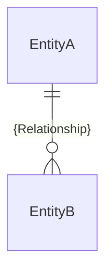

# Model schema — {Product_Name}

## Entity-Relationship diagram

```mermaid
erDiagram
    EntityA ||--o{ EntityB : "{Relationship}"
```

## Entities

- **{EntityA}** — {short description}
- **{EntityB}** — {short description}

---

> last updated: {DateTime}
