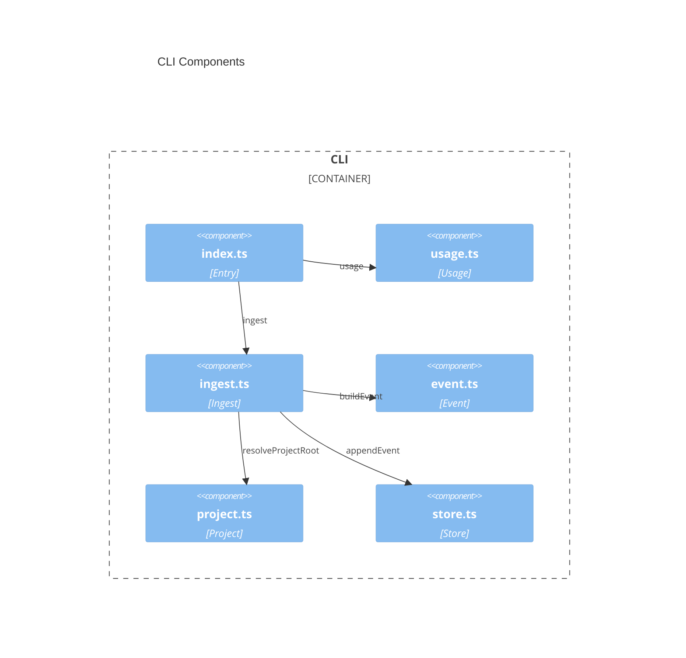

# CLI architecture — audit-bot

> Container `cli` from [`system.arch.md`](./system.arch.md).
> Tier: `cli`.


## Overview

Node.js TypeScript CLI (ESM, Bun as package manager and runner). Observe-only hook ingest: `ingest` reads one stdin JSON object (`readFileSync(0)`), appends one Event JSONL line under the resolved project's `temp/audit/`, and always exits 0 with no stdout (`runIngest` `finally`). There is no health tracer. Reports and query commands are not implemented. Runtime `dependencies` are empty. Package `name` and `bin` remain `cli-node` (`bin` points at `src/index.ts`, not `dist/`). Intended compile output is ESM `.js` for Node ≥ 24 or Bun (`cli/tsconfig.build.json` emits `dist/*.js` under `"type": "module"`, not `.mjs` filenames).

- **Folder**: `cli/`
- **Archetype**: TypeScript — Node CLI (Bun, Oxlint)

### Dependencies

- **Depends on**: Node ≥ 24 or Bun ≥ 1.4 (no sibling containers)
- **Used by**: Developer (local run/tests). Agent hosts (Cursor, Claude, Copilot) invoke ingest via project-level hook config at repo root
- **Libraries**: none (`dependencies`: `{}`). Tests use `node:test` and `node:assert`

### CLI surface (not HTTP)

No HTTP API; no [`api.schema.md`](../model/api.schema.md). Commands:

| argv | Behavior |
|------|----------|
| `ingest {harness} {optionalHookEventHint}` | stdin: one JSON object; append one Event under `{projectRoot}/temp/audit/events.jsonl`; `exitCode` 0; no stdout. Failures are swallowed (still 0, no blocking/mutating stdout). `{harness}` is `cursor` \| `claude` \| `copilot`. `hookEvent`: non-empty payload `hook_event_name`, else argv hint, else no line |
| omitted, `health`, or anything else | stderr: `usage: cli-node ingest {harness} [hookEventHint]`; `process.exitCode` 1. No “up and running” line |

Silent no-ops (still exit 0, no file): non-JSON stdin, JSON array/primitive, missing/invalid harness, missing hookEvent, missing project root, lock/disk throw.

Project-level hook registration (repo root, not under `cli/`):

| Harness | Config | Command |
|---------|--------|---------|
| Cursor | `.cursor/hooks.json` | `node cli/src/index.ts ingest cursor {event}` for `sessionStart`, `sessionEnd`, `beforeSubmitPrompt`, `stop` |
| Claude | `.claude/settings.json` | exec form `node` + `${CLAUDE_PROJECT_DIR}/cli/src/index.ts ingest claude` (no argv hint; payload `hook_event_name`) for `SessionStart`, `SessionEnd`, `UserPromptSubmit`, `Stop` |
| Copilot | `.github/hooks/audit-ingest.json` | `node cli/src/index.ts ingest copilot {event}` for `sessionStart`, `sessionEnd`, `userPromptSubmitted`, `agentStop` |

---

## Components diagram (C4 L3)



---

## Code organization

**Pattern**: Layer-based (entry → ingest). Tests live beside source under `test/`, not colocated.

```text
cli/
├── src/index.ts           # shebang entry; argv dispatch; stdin; exitCode
├── src/usage.ts           # usageMessage (non-ingest argv)
├── src/ingest.ts          # ingestHook (observe-only; never throws)
├── src/event.ts           # omitEmpty, buildEvent
├── src/project.ts         # resolveProjectRoot
├── src/store.ts           # appendEvent (locked JSONL)
├── test/*.test.ts         # node:test for exported lib functions + usageMessage
├── package.json           # scripts, engines, bin cli-node
├── tsconfig.json          # noEmit typecheck
├── tsconfig.build.json    # emit dist/
└── .oxlint.json           # lint (complexity 8 in config)
```

Store file: `{projectRoot}/temp/audit/events.jsonl`. Sidecar lock: `{projectRoot}/temp/audit/events.jsonl.lock` (`open(..., "wx")`; wait 400ms, retry 10ms; stale mtime > 2000ms unlinked). Project root: `CURSOR_PROJECT_DIR`, then `CLAUDE_PROJECT_DIR`, then payload `cwd`, then first `workspace_roots` string (`path.normalize`).

---

> last updated: 2026-08-31T19:59:36Z
