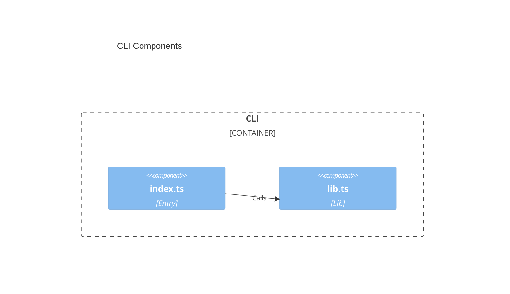

# CLI architecture — audit-bot

> Container `cli` from [`system.arch.md`](./system.arch.md).
> Tier: `cli`.


## Overview

Node.js TypeScript CLI (ESM, Bun as package manager and runner). Today it is the `cli-node` health tracer: argv dispatch in `src/index.ts` and a single exported `getHealthMessage()` in `src/lib.ts`. It prints one line to stdout or a usage line to stderr. It does not ingest agent hooks, persist events, or bind a port. Runtime `dependencies` are empty. Intended later: hook ingest/report as MJS for Node ≥ 24 or Bun. **Contradiction:** `package.json` `name`/`bin` are still `cli-node`; `tsc` emit is `dist/*.js` under `"type": "module"`, not `.mjs` filenames.

- **Folder**: `cli/`
- **Archetype**: TypeScript — Node CLI (Bun, Oxlint)

### Dependencies

- **Depends on**: Node ≥ 24 or Bun ≥ 1.4 (no sibling containers)
- **Used by**: Developer (local run/tests). Agent hosts (Cursor, Claude, Copilot) are intended callers, not wired
- **Libraries**: none (`dependencies`: `{}`). Tests use `node:test` and `node:assert`

### CLI surface (not HTTP)

No HTTP API; no [`api.schema.md`](../model/api.schema.md). Commands:

| argv | Behavior |
|------|----------|
| omitted or `health` | stdout: `the app is up and running (<ISO-8601>)` |
| anything else | stderr: `usage: cli-node [health]`; `process.exitCode = 1` |

---

## Components diagram (C4 L3)



---

## Code organization

**Pattern**: Layer-based (entry → lib). Tests live beside source under `test/`, not colocated.

```text
cli/
├── src/index.ts           # shebang entry; argv dispatch
├── src/lib.ts             # getHealthMessage
├── test/lib.test.ts       # node:test for getHealthMessage
├── package.json           # scripts, engines, bin cli-node
├── tsconfig.json          # noEmit typecheck
├── tsconfig.build.json    # emit dist/
└── .oxlint.json           # lint (complexity 8 in config)
```

---

> last updated: 2026-08-31T18:05:15Z
