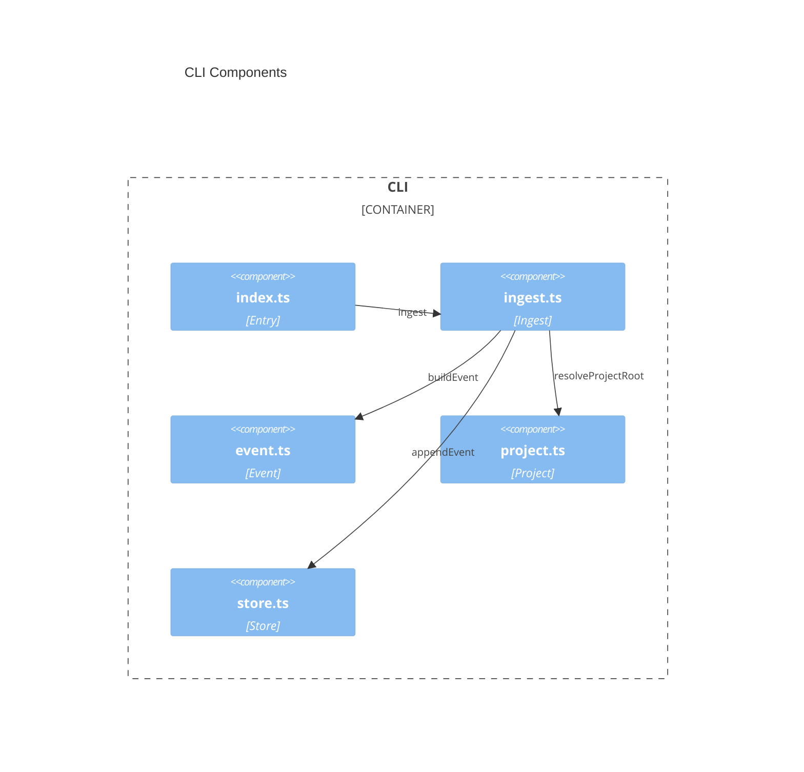

# CLI architecture — audit-bot

> Container `cli` from [`system.arch.md`](./system.arch.md).
> Tier: `cli`.


## Overview

Node.js TypeScript CLI (ESM, Bun as package manager and runner). Observe-only hook ingest: `ingest` reads one stdin JSON object, appends one Event JSONL line under the resolved project's `temp/audit/`, and always exits 0 with no stdout. There is no health tracer. Reports and query commands are not implemented. Runtime `dependencies` are empty. Package `name` and `bin` remain `cli-node`. Intended compile output is MJS for Node ≥ 24 or Bun (`cli/tsconfig.build.json` emits `dist/*.js` under `"type": "module"`, not `.mjs` filenames).

- **Folder**: `cli/`
- **Archetype**: TypeScript — Node CLI (Bun, Oxlint)

### Dependencies

- **Depends on**: Node ≥ 24 or Bun ≥ 1.4 (no sibling containers)
- **Used by**: Developer (local run/tests). Agent hosts (Cursor, Claude, Copilot) invoke ingest via project-level hook config
- **Libraries**: none (`dependencies`: `{}`). Tests use `node:test` and `node:assert`

### CLI surface (not HTTP)

No HTTP API; no [`api.schema.md`](../model/api.schema.md). Commands:

| argv | Behavior |
|------|----------|
| `ingest {harness} {optionalHookEventHint}` | stdin: one JSON object; append one Event under `{projectRoot}/temp/audit/events.jsonl`; `exitCode` 0; no stdout. Failures are swallowed (still 0, no blocking/mutating stdout). `{harness}` is `cursor` \| `claude` \| `copilot` |
| omitted, `health`, or anything else | stderr: usage that names ingest and does not name health; `process.exitCode` 1. No “up and running” line |

---

## Components diagram (C4 L3)



---

## Code organization

**Pattern**: Layer-based (entry → ingest). Tests live beside source under `test/`, not colocated.

```text
cli/
├── src/index.ts           # shebang entry; argv dispatch
├── src/usage.ts           # usageMessage (non-ingest argv)
├── src/ingest.ts          # ingestHook (observe-only)
├── src/event.ts           # omitEmpty, buildEvent
├── src/project.ts         # resolveProjectRoot
├── src/store.ts           # appendEvent (locked JSONL)
├── test/*.test.ts         # node:test for exported lib functions
├── package.json           # scripts, engines, bin cli-node
├── tsconfig.json          # noEmit typecheck
├── tsconfig.build.json    # emit dist/
└── .oxlint.json           # lint (complexity 8 in config)
```

Store file: `{projectRoot}/temp/audit/events.jsonl`. Project root: `CURSOR_PROJECT_DIR`, then `CLAUDE_PROJECT_DIR`, then payload `cwd`, then first `workspace_roots` string.

---

> last updated: 2026-08-31T19:19:40Z
