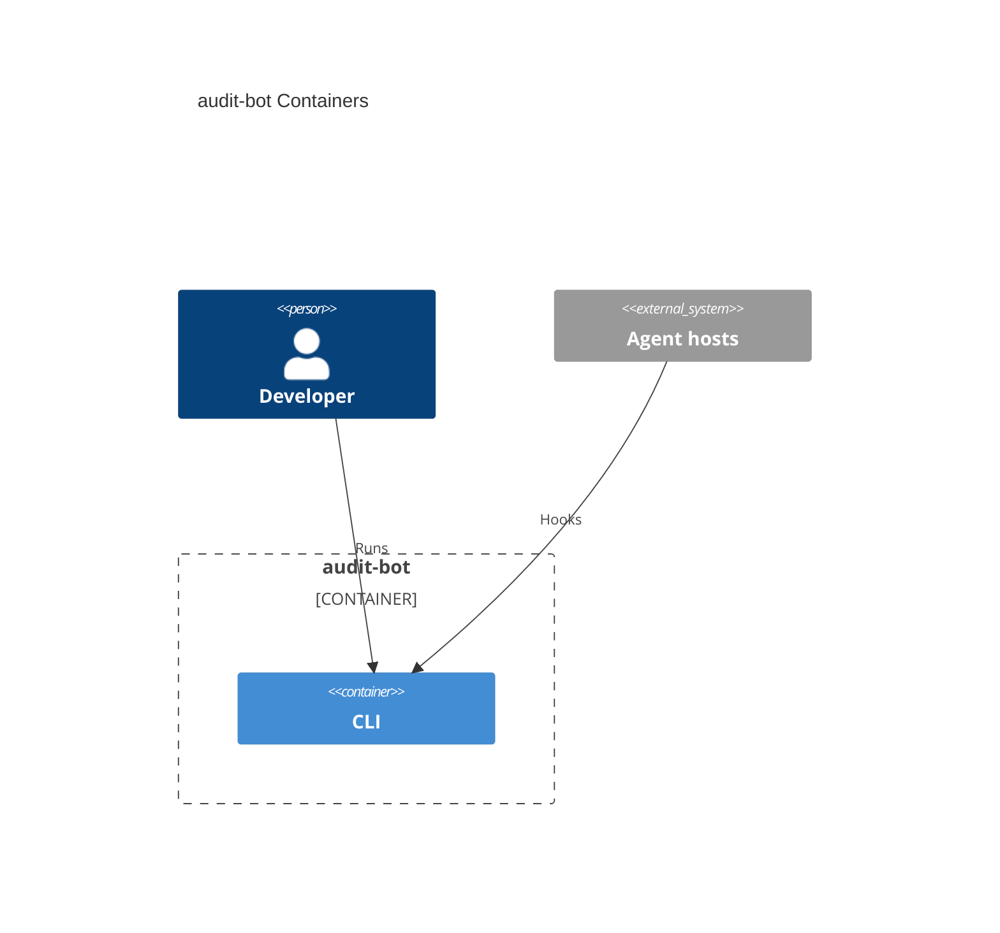

# System architecture — audit-bot

## Overview

audit-bot ingests agent-hook events (session start/end, prompts, duration) from Cursor, Claude, and Copilot into a project-local JSONL log. The repository holds one product container: a Node.js CLI from [AIDDbot/cli-node](https://github.com/AIDDbot/cli-node), shipped as `cli-node` 0.4.0 (F001 released). There is no health tracer. Ingest is observe-only: exit 0, no blocking/mutating stdout. Reports are not implemented. There is no back, front, or db container. A thin `e2e/` folder of spawn tests lives at the repo root (not a product container); those tests spawn `cli/src/index.ts`. Package `name` and `bin` remain `cli-node` (pending rename). Official compile dest is `.agents/hooks/index.mjs` (tracked; folder gitignores `*.js` and `*.map`). How to build: `cd cli && bun run build`. Rebuild after `cli/src` edits. Project-level hook configs invoke `node .agents/hooks/index.mjs`. Recipe: [`.agents/hooks/README.md`](../../.agents/hooks/README.md). Root `package.json` is workspace metadata (`audit-bot` 0.0.1, empty `dependencies`, Bun 1.4) and is not a container; `oxlint-tsgolint` is a `cli` devDependency.

---

## Containers diagram



## cli

- **Folder**: `cli/`
- **Tier**: `cli`
- **Archetype**: TypeScript — Node CLI (Bun 1.4+, Oxlint, Node ≥ 24)
- **Detail**: [`cli.arch.md`](./cli.arch.md)

### Scripts
```bash
cd cli
bun start              # bun src/index.ts — omitted argv → usage, exit 1
bun dev                # watch mode
bun run typecheck      # tsc -p tsconfig.json --noEmit
bun run build          # → {repo}/.agents/hooks/index.mjs (do not use tsc; do not emit cli/dist)
bun run test           # node --test test/*.test.ts
bun lint               # oxlint --fix --format=agent --quiet
```

From repo root: `node --test e2e/*.test.ts` (Node 26 on Windows does not treat a directory name as a test glob).

---

> last updated: 2026-08-31T20:19:58Z
