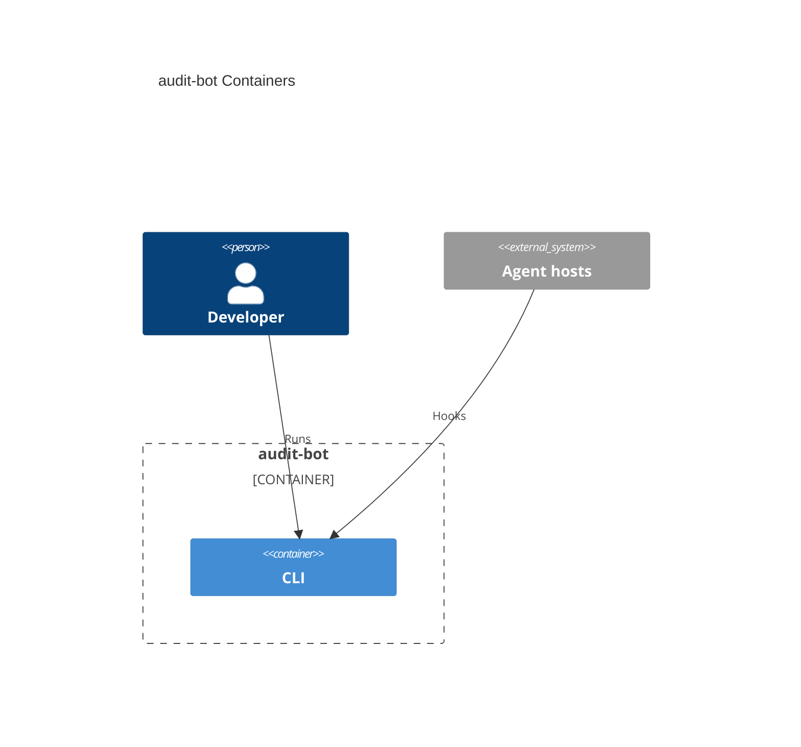

# System architecture — audit-bot

## Overview

audit-bot ingests Cursor hook events into a project-local daily Event log (JSONL, verbatim), a Session index (JSON array of distinct session identifiers), a Session YAML log (one append-only `{session_id}.yaml` per distinct identifier), and a Session report (Markdown `{session_id}.md` overwritten on every later YAML append for that session the same day). Cursor invokes the CLI on `sessionStart`, `sessionEnd`, `subagentStart`, `subagentStop`, `beforeSubmitPrompt`, and `stop` with `node .agents/hooks/index.mjs ingest cursor {event}`.

---

## Containers diagram



## cli

- **Folder**: `cli/`
- **Tier**: `cli`
- **Archetype**: TypeScript — Node CLI (Bun 1.4+, Oxlint, Node ≥ 24)
- **Detail**: [`cli.arch.md`](./cli.arch.md)

- Unit tests: `cli/test/` via `cd cli && bun run test`
- Functional e2e: repo-root `e2e/` via `node --test e2e/*.test.ts` (spawn `cli/src/index.ts`)

### Scripts
```bash
cd cli
bun start              # bun src/index.ts — omitted argv → usage, exit 1
bun dev                # watch mode
bun typecheck          # tsc -p tsconfig.json --noEmit
bun lint               # oxlint -c .oxlint.json --format=agent --quiet src scripts
bun run build          # → {repo}/.agents/hooks/index.mjs (do not use tsc; do not emit cli/dist)
bun test           # node --test test/*.test.ts
```

From repo root: `node --test e2e/*.test.ts` (Node 26 on Windows does not treat a directory name as a test glob).

---

> last updated: 2026-09-01T12:20:23Z
