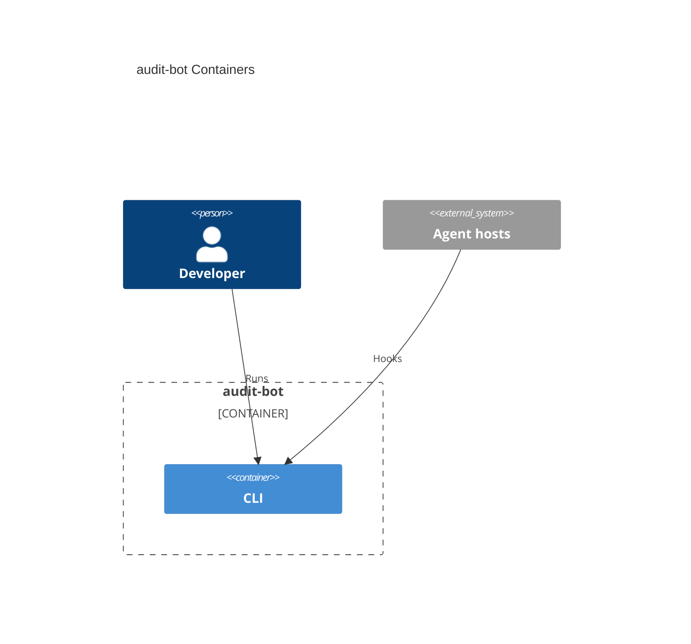

# System architecture — audit-bot

## Overview

audit-bot ingests agent-hook events (session start/end, prompts, duration) from Cursor, Claude, and Copilot into a project-local JSONL log. 

---

## Containers diagram



## cli

- **Folder**: `cli/`
- **Tier**: `cli`
- **Archetype**: TypeScript — Node CLI (Bun 1.4+, Oxlint, Node ≥ 24)
- **Detail**: [`cli.arch.md`](./cli.arch.md)

- NO E2E TESTS, just unit tests in `test/`


### Scripts
```bash
cd cli
bun start              # bun src/index.ts — omitted argv → usage, exit 1
bun dev                # watch mode
bun typecheck          # tsc -p tsconfig.json --noEmit
bun lint               # oxlint --fix --format=agent --quiet
bun run build          # → {repo}/.agents/hooks/index.mjs (do not use tsc; do not emit cli/dist)
bun test           # node --test test/*.test.ts
```

From repo root: `node --test e2e/*.test.ts` (Node 26 on Windows does not treat a directory name as a test glob).

---

> last updated: 2026-08-31T20:56:34Z
