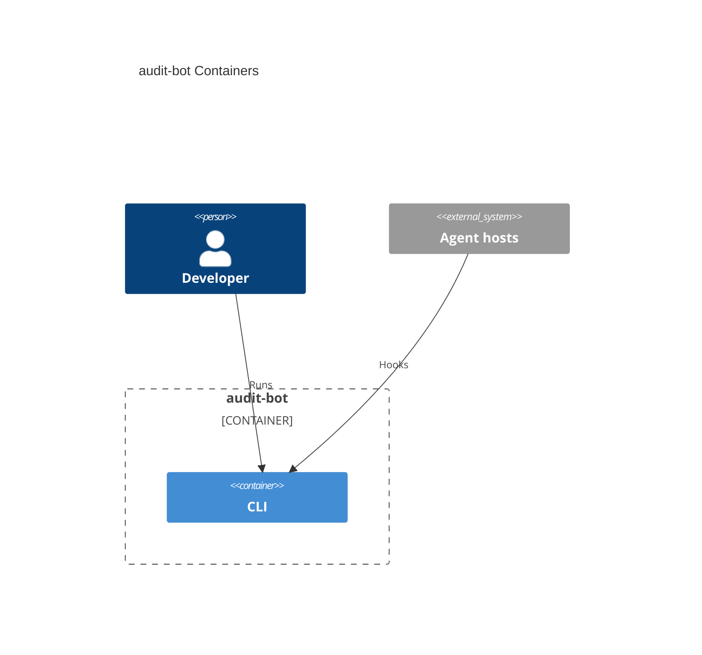

# System architecture — audit-bot

## Overview

audit-bot is a CLI meant to ingest and report agent-hook events (session start/end, prompts, duration) from Cursor, Claude, and Copilot. The repository currently holds one container: a Node.js CLI scaffolded from [AIDDbot/cli-node](https://github.com/AIDDbot/cli-node). That container is a **health tracer** (`the app is up and running (<ISO-8601 datetime>)`); it does not yet ingest hooks or emit reports. There is no back, front, db, or e2e container. Package `name` and `bin` remain `cli-node` (pending rename). Intended compile output is MJS for Node ≥ 24 or Bun (`cli/tsconfig.build.json` emits `dist/`).

---

## Containers diagram



## cli

- **Folder**: `cli/`
- **Tier**: `cli`
- **Archetype**: TypeScript — Node CLI (Bun 1.4+, Oxlint, Node ≥ 24)
- **Detail**: [`cli.arch.md`](./cli.arch.md)

### Scripts
```bash
cd cli
bun start              # bun src/index.ts — health line to stdout
bun dev                # watch mode
bun run typecheck      # tsc -p tsconfig.json --noEmit
bun run build          # tsc -p tsconfig.build.json → dist/
bun run test           # node --test test/lib.test.ts
bun lint               # oxlint --fix --format=agent --quiet
```

---

> last updated: 2026-08-31T18:04:05Z
