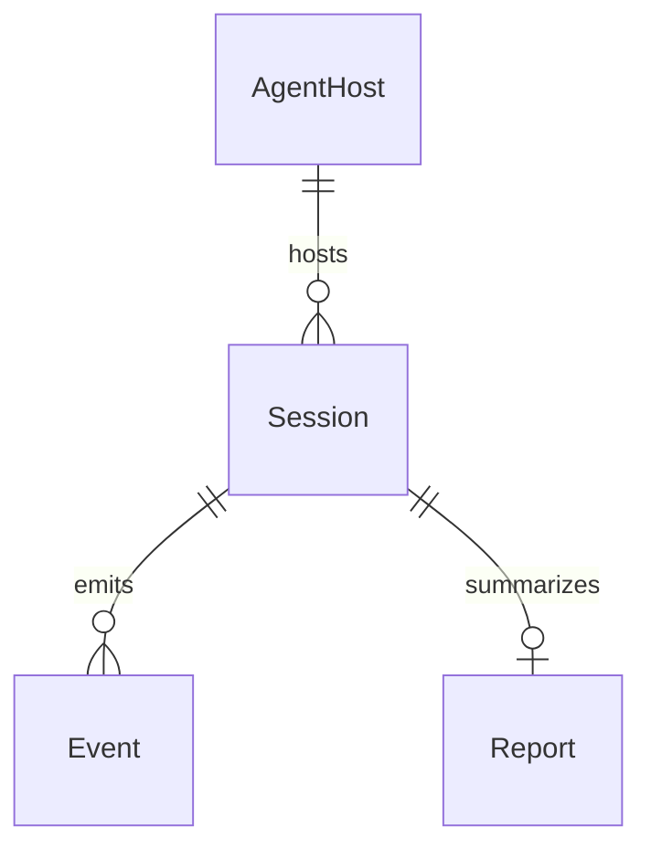

# Model schema — audit-bot

Conceptual model from product intent (agent-hook ingest and report). **Event** is the only persisted record (JSONL). **Session** is not a separate file (identity lives on the payload). **Report** is unused. There is no Health entity.

## Entity-Relationship diagram

## Entities

- **AgentHost** — Cursor, Claude, or Copilot (the environment that fires hooks). Stored on Event as `harness`: `"cursor"` \| `"claude"` \| `"copilot"` (argv, not inferred from the payload).
- **Session** — one agent session with start, end, and duration. Not a persisted entity; identity is whatever the payload already carries (`conversation_id` / `session_id` / `sessionId`). Duration is payload `duration_ms` when the harness sends it.
- **Event** — one JSON object per line in `{projectRoot}/temp/audit/events.jsonl`. Overlay last: `{ ...omitEmpty(payload), harness, receivedAt, hookEvent }`. `receivedAt` is `Date.toISOString()` at ingest. `hookEvent` is non-empty payload `hook_event_name` if present, else the optional argv hint. Payload keys that still have a value after omit of null/empty (`""`, `[]`, `{}`, including nested keys; empty parents omitted after nested omit) remain — including `hook_event_name` itself. `0`, `false`, and non-empty strings stay. Overlay keys win over payload keys of the same name.
- **Report** — aggregated view of a session's events for a human or another tool (not implemented).

---

> last updated: 2026-08-31T19:59:36Z
