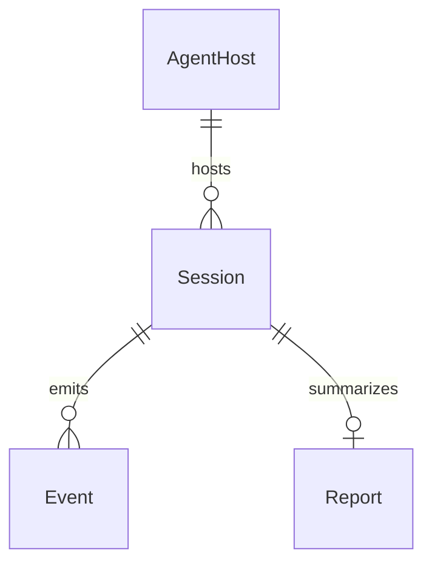

# Model schema — audit-bot

Intended conceptual model from product intent (agent-hook ingest and report). **Not present in the current tracer codebase** — the CLI has no persisted entities yet.

## Entity-Relationship diagram

## Entities

- **AgentHost** — Cursor, Claude, or Copilot (the environment that fires hooks)
- **Session** — one agent session with start, end, and duration
- **Event** — a hook payload: session start/end, prompt, or duration (and later kinds)
- **Report** — aggregated view of a session's events for a human or another tool

---

> last updated: 2026-08-31T18:04:05Z
