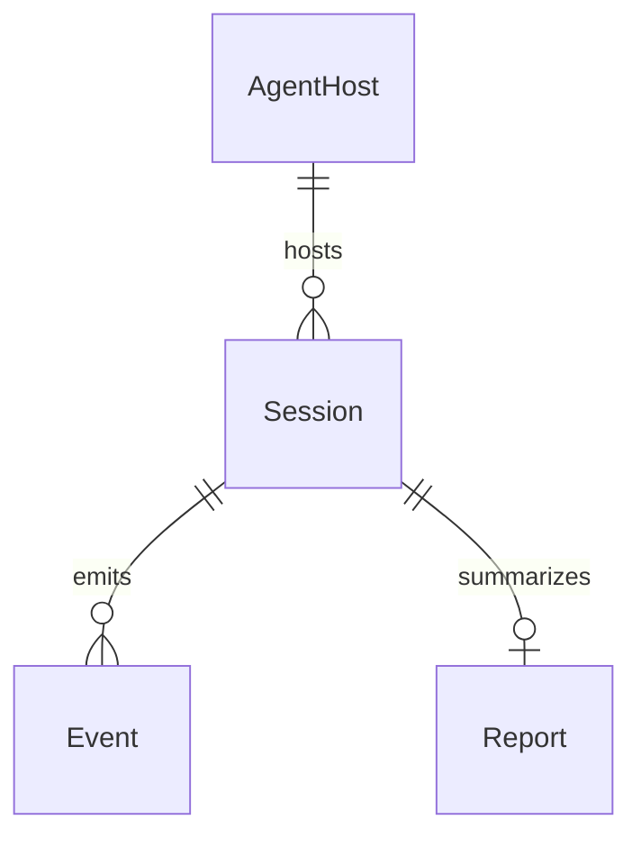

# Model schema — audit-bot

Conceptual model from product intent (agent-hook ingest and report). **Event** is persisted as JSONL. **Session** is not a separate file (identity lives on the payload). **Report** is unused.

## Entity-Relationship diagram

## Entities

- **AgentHost** — Cursor, Claude, or Copilot (the environment that fires hooks). Stored on Event as `harness`: `"cursor"` \| `"claude"` \| `"copilot"`.
- **Session** — one agent session with start, end, and duration. Not a persisted entity; identity is whatever the payload already carries (`conversation_id` / `session_id` / `sessionId`).
- **Event** — one JSON object per line in `{projectRoot}/temp/audit/events.jsonl`: `harness`, ISO 8601 `receivedAt`, `hookEvent`, plus stdin payload fields after omit of null/empty keys (`""`, `[]`, `{}`).
- **Report** — aggregated view of a session's events for a human or another tool (not implemented).

---

> last updated: 2026-08-31T18:50:41Z
